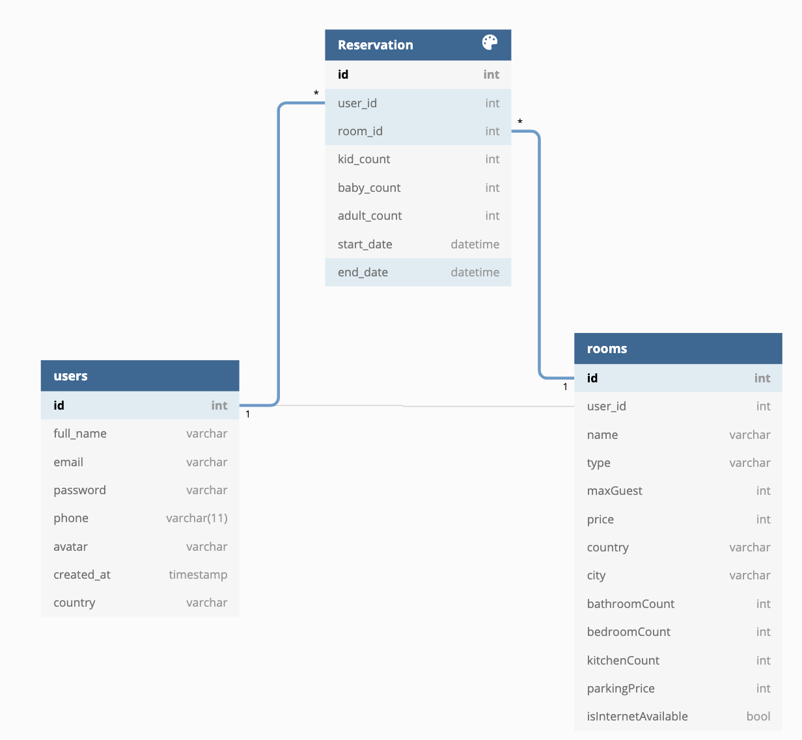

<h1 align="center">✈️AIRBNB🏠</h1>
<p>
  
  <a href="https://github.com/samrho/custom-airbnb" target="_blank">
    
  </a>
</p>

> clone service of AirBnb

### 🏠 [Homepage](https://github.com/samrho/custom-airbnb)

### ✨ [Demo](https://github.com/samrho/custom-airbnb)

## Install

```sh
npm install
```

## Run tests

```sh
npm test
```


## ER Diagram


## Tech stack

## Author

👤 **Sam Rho**

-   Github: [@samrho](https://github.com/samrho)

## 🤝 Contributing

Contributions, issues and feature requests are welcome!<br />Feel free to check [issues page](https://github.com/samrho/custom-airbnb/issues).

## Show your support

Give a ⭐️ if this project helped you!

---

_This README was generated with ❤️ by [readme-md-generator](https://github.com/kefranabg/readme-md-generator)_
